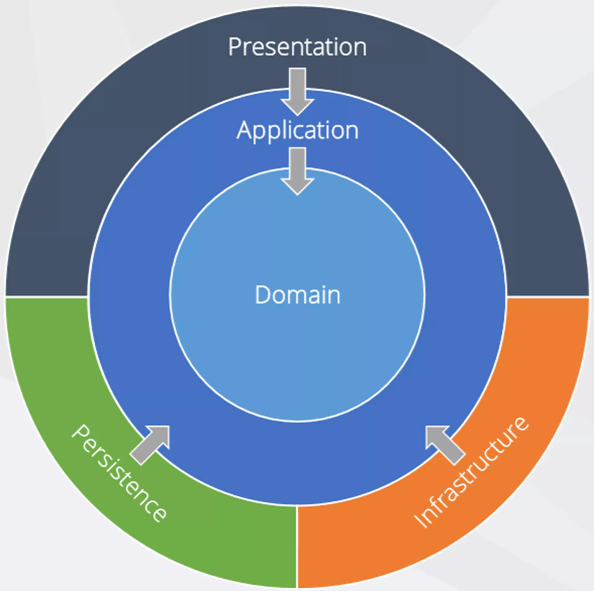

# VibeCRM

VibeCRM is a modern, enterprise-grade Customer Relationship Management system built using Clean Architecture principles and the latest ASP.NET Core stack. It provides a comprehensive solution for managing customer relationships, sales pipelines, and business workflows.

## Architecture Overview

VibeCRM follows the Onion Architecture (also known as Clean Architecture) pattern, which organizes code into concentric layers with dependencies pointing inward. This ensures a separation of concerns and makes the system more maintainable, testable, and adaptable to change.



### Key Architectural Principles

- **Separation of Concerns**: Each layer has a specific responsibility
- **Dependency Inversion**: High-level modules don't depend on low-level modules
- **SOLID Principles**: Single Responsibility, Open-Closed, Liskov Substitution, Interface Segregation, Dependency Inversion
- **CQRS Pattern**: Command Query Responsibility Segregation for separating read and write operations
- **Domain-Driven Design**: Focus on the core domain and domain logic

## Project Structure

VibeCRM is organized into the following projects, each representing a layer in the Clean Architecture:

```
VibeCRM/
├── VibeCRM.Domain/           # Core domain entities and business rules
├── VibeCRM.Application/      # Application services, commands, and queries
├── VibeCRM.Infrastructure/   # External concerns like database, file systems, etc.
├── VibeCRM.Api/              # API controllers and Blazor UI components
└── VibeCRM.Shared/           # Shared utilities and DTOs
```

## Layer Interactions

### Domain Layer (VibeCRM.Domain)

- The innermost layer containing business entities, value objects, and domain logic
- Has no dependencies on other layers or external frameworks
- Defines interfaces that are implemented by outer layers

**Key Components:**
- Domain Entities
- Value Objects
- Domain Events
- Repository Interfaces
- Domain Services

### Application Layer (VibeCRM.Application)

- Contains application logic and orchestrates the domain objects
- Implements the CQRS pattern using MediatR
- Depends only on the Domain layer

**Key Components:**
- Commands and Command Handlers
- Queries and Query Handlers
- DTOs (Data Transfer Objects)
- Validators
- Application Services

### Infrastructure Layer (VibeCRM.Infrastructure)

- Provides implementations for interfaces defined in the Domain and Application layers
- Contains database access, external services, and other infrastructure concerns
- Depends on the Domain and Application layers

**Key Components:**
- Repository Implementations using Dapper
- Database Connection Management
- External Service Implementations
- Authentication Services
- Logging Services

### API Layer (VibeCRM.Api)

- The outermost layer containing API controllers and Blazor UI components
- Handles HTTP requests and user interactions
- Depends on the Application layer to process requests

**Key Components:**
- API Controllers
- Blazor Components
- Middleware
- Filters
- Authentication/Authorization

### Shared Layer (VibeCRM.Shared)

- Contains cross-cutting concerns and utilities
- Used by multiple layers
- Contains no business logic

**Key Components:**
- Constants
- Enums
- Utility Classes
- Shared DTOs

## Data Flow

1. **API Request Flow**:
   - Client sends HTTP request to API controller
   - Controller creates command/query and sends it to MediatR
   - MediatR dispatches to appropriate handler
   - Handler uses repositories to access data
   - Repository uses Dapper to execute SQL
   - Response flows back through the layers

2. **Command Flow (Write Operations)**:
   - API Controller → Command → Command Handler → Repository → Database
   - Validation occurs in the Command Handler via FluentValidation
   - Domain events may be triggered during entity changes

3. **Query Flow (Read Operations)**:
   - API Controller → Query → Query Handler → Repository → Database
   - Results are mapped to DTOs before returning to the controller

4. **Resilience Patterns**:
   - Repository methods implement retry policies using Polly
   - Transient SQL errors are automatically retried with exponential backoff
   - Circuit breaker patterns prevent cascading failures
   - Timeout policies ensure responsiveness under load
   - All resilience policies are configured in the Infrastructure layer

## Technology Stack

- **Backend**: ASP.NET Core 8.0
- **API**: ASP.NET Core Web API
- **Frontend**: Blazor with Fluent UI
- **Database**: MS SQL Server
- **ORM**: Dapper
- **Authentication**: JWT
- **Validation**: FluentValidation
- **Logging**: Serilog
- **Documentation**: Swagger/OpenAPI
- **Messaging**: MediatR
- **Resilience**: Polly

## Development Guidelines

### Adding New Features

1. Start with the Domain layer (entities, interfaces)
2. Move to the Application layer (commands, queries, handlers)
3. Implement infrastructure concerns (repositories, services)
4. Finally, add API endpoints and UI components

### Coding Standards

- Follow SOLID principles
- Use CQRS with MediatR for all operations
- Provide comprehensive XML documentation
- Implement proper validation using FluentValidation
- Follow RESTful API design principles
- Use Fluent UI for all frontend components

## Getting Started

### Prerequisites

- .NET 8.0 SDK
- Visual Studio 2022
- SQL Server (local or remote)

### Setup

1. Clone the repository
2. Update the connection string in `appsettings.json`
3. Run database migrations
4. Build and run the application

```bash
# Clone the repository
git clone https://github.com/yourusername/VibeCRM.git

# Navigate to the project directory
cd VibeCRM

# Build the solution
dotnet build

# Run the API
cd VibeCRM.Api
dotnet run
```

## Documentation

Each project contains its own README.md with detailed information about its structure, components, and guidelines:

- [Domain Layer Documentation](VibeCRM.Domain/README.md)
- [Application Layer Documentation](VibeCRM.Application/README.md)
- [Infrastructure Layer Documentation](VibeCRM.Infrastructure/README.md)
- [API Layer Documentation](VibeCRM.Api/README.md)

## License

NOT OPEN SOURCE. Copyright 2025 - Donald J Bartlett - All rights reserved.
